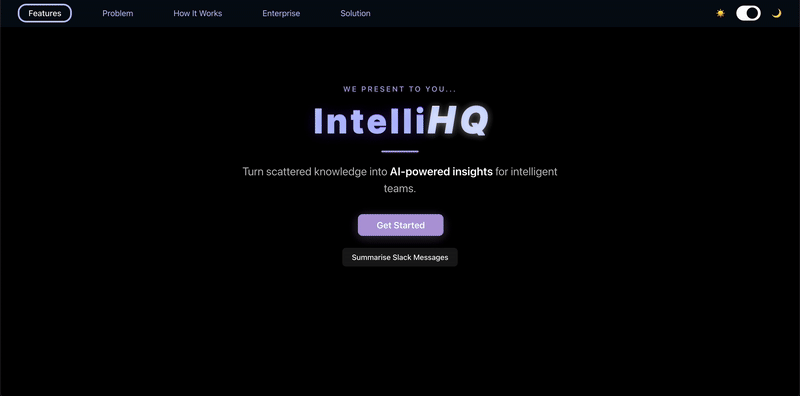

# spur-hacks-2025 Task Breakdown

12-Hour MVP Breakdown (Team of 4)
1. Data Ingestion (2–3 hours)
📥 Tool: Slack (or GitHub or Notion — pick one only)
🔧 API: Use Slack Web API to pull recent messages
🧑‍💻 Team Member: 1 person to set up the connector + save to local storage (e.g., JSON/SQLite)

2. Basic Backend (2 hours)
🔌 Framework: Flask or FastAPI
🧠 Endpoint: /get_summary, /ask_question
🧑‍💻 Team Member: 1 person to write API routes that load the data + talk to the LLM (e.g., OpenAI)

3. LLM Integration (2 hours)
🤖 Tool: OpenAI GPT-4 or GPT-3.5 API
🔄 Prompt: “Summarize this Slack thread” or “What are the blockers from these messages?”
🧑‍💻 Team Member: 1 person builds prompts, sends data to GPT, gets results

4. Frontend UI (3 hours)
🖥 Framework: React or plain HTML/JS if you're short on time
🔲 Pages: Input your Slack token → “Get Summary” → Show response
🧑‍💻 Team Member: 1 person builds interface + connects to API

5. Testing + Polish (2 hours)
🚨 Add error handling
✨ Maybe style it with TailwindCSS or Bootstrap
📦 Package for demo / pitch
